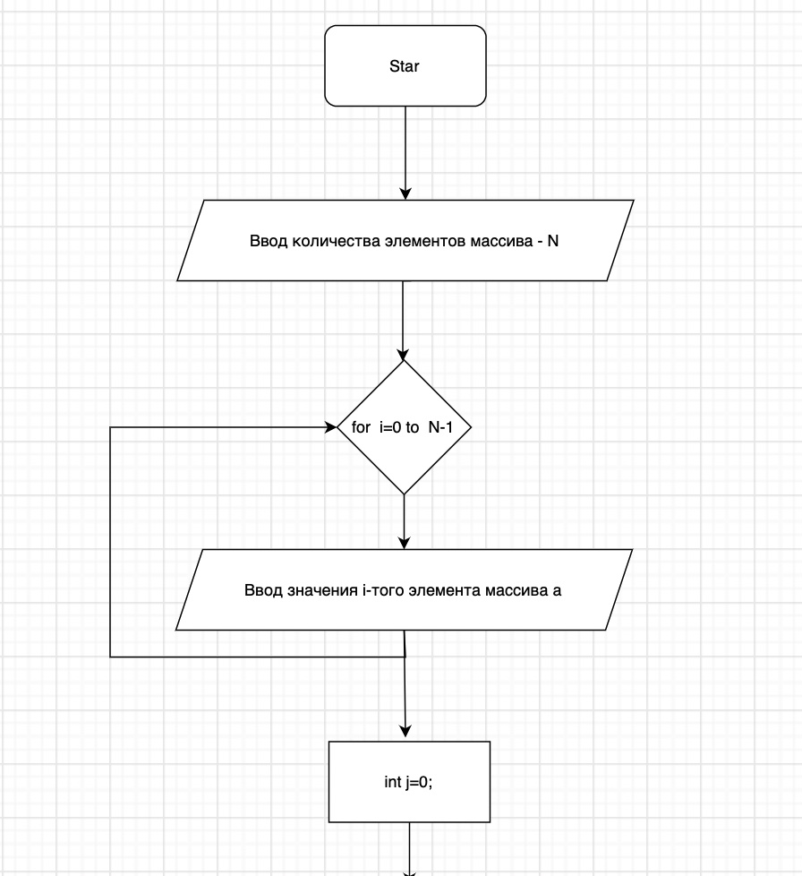
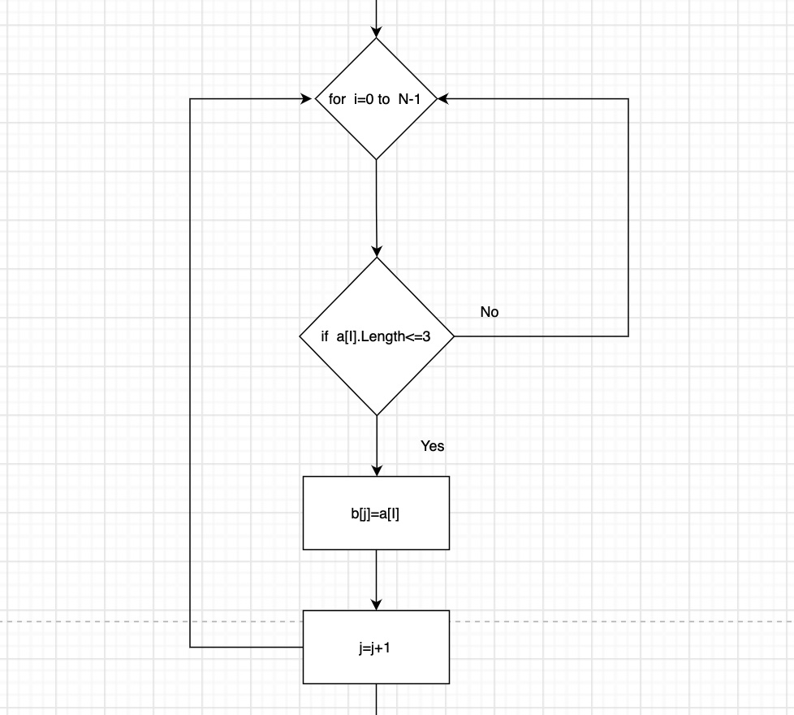
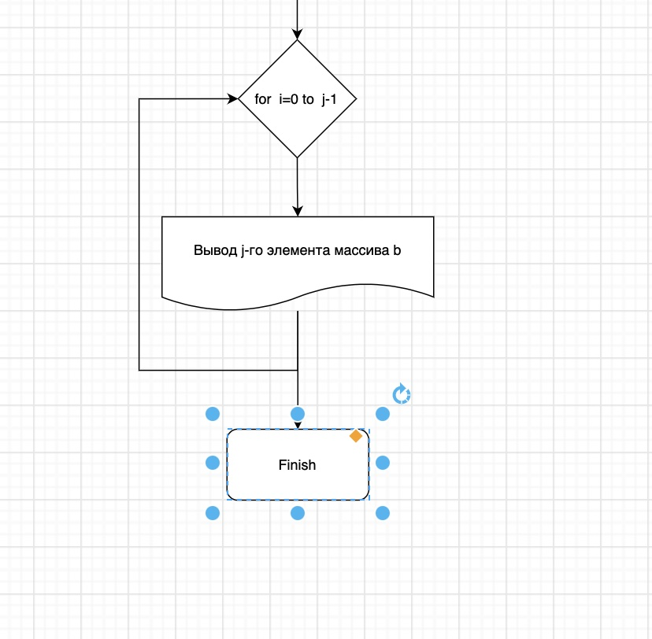

# Описание решения контрольной работы
## Cтруктура предлагемого решения.

Задача реализована за счет использования трех методов:
 * _CreateArray_ - создание массива из произвольных значенний, которые вводит пользователь;
 * _SortArray_ - сортировка массива, поиск значений массива длинна которых менее или равна 3 символам;
 * _PrintArray_ - вывод на экран всех элементов массива.

## 1.CreateArray 

Пользователь вводит длинну массива, далее вызвается метод, который исходя из длинны массива запрашивает ввод очередного i-го элемента. Метод возвращает массив с элементами типа __string__.

## 2.SortArray 

В рамках метода проверяется значение всех элементов массива и в случае если длинна элемента соответсвует условию, данный элемент добавляется в новый массив. Метод возвращает отсортированный массив с элементами типа __string__.

## 3.PrintArray 

Метод выводит на экран все элементы массива и не возвращает никаких значений.

